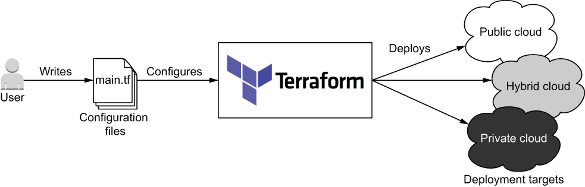
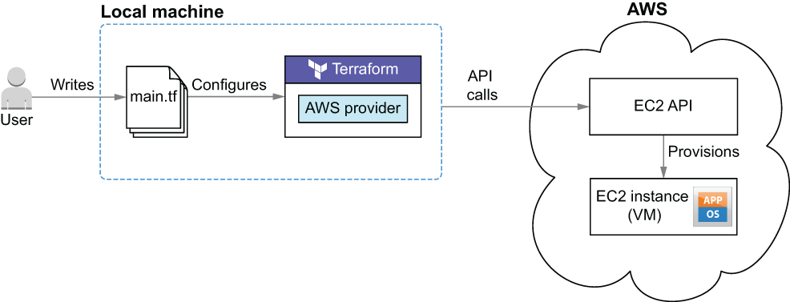

# Capitulo 1

## Iniciando com Terraform

Terraform é uma tecnologia de implantação para qualquer pessoa que deseja provisionar e gerenciar infrastructure as code (IaC).

Infrastructure as code é o processo de gerenciar e provisionar infraestrutura por meio de arquivos de definição legíveis por máquina. Utilizamos o IaC para automatizar processos que costumavam ser feitos manualmente.

A ideia central do Terraform é possibilitar a criação de código de configuração legível por humanos para definir uma infrastructure as code (IaC), o que permite a implantação de ambientes repetíveis, efêmeros e consistentes em provedores de nuvens, sejam públicas, privadas ou híbridas

O Terraform pode implantar infraestrutura em qualquer nuvem ou combiná-las.
***
## O que faz o Terraform tão bom ?
Existem 6 características que tornam o Terraform único e competitivo em comparação com outros.

- Provisioning tool - Deploys infraestrutura, não apenas aplicacão.
- Facil de usar -  Para nós nao genios.
- Free e open source
- Declarativo - Diz o que voce quer, nao como fazer.
- Cloud agnostico - Deploy para qualquer cloud usando a mesma ferramenta.
- Expressivo e expansível — Você não está limitado pela linguagem.
***

## "Hello Terraform"
Nessa secão o autor vai deployar uma virtual machine (EC2 instance) dentro da AWS. Vamos usar o provider da AWS para o Terraform fazer chamada API em nosso nome e deloy um EC2 instance.

A figura mostra a arquitetura da implantação da instância EC2 na AWS.

Passos para fazer o deploy do projeto: 
 
1. Escrever arquivo de configuracão Terraform
2. Configurar o provider AWS
3. Inicializar o Terraform com **terraform init**
4. Deploy da EC2 com **terraform apply**
5. Limpar com **terraform destroy**

O Terraform lê de arquivos de configuração para implantar infraestrutura. Para informar ao Terraform que queremos que ele implante uma instância EC2, precisamos declarar uma instância EC2 como código.

> **Observação:** Para manter o repositorio organazado o codigo do terraform ficará na pasta **code**