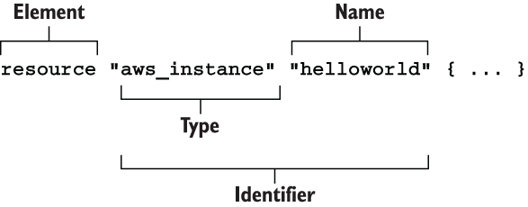

# Explicando o block resource do Terraform

A tipagem do HCL declara resource como objetos, com exatamente dois rótulos. A primeira label especifica o tipo de resource que voce deseja criar, o segundo o nome do resource. O nome não possui significado especial e é usado apenas para fazer referência ao resource dentro do escopo de um módulo específico. Juntos, o tipo e o nome do resource compõem o identificador do resource, que é exclusivo para cada resource.

A figura abaixo mostra a sintaxe de um bloco de resource no Terraform.


Cada resource tem inputs and outputs. Inputs são chamados de arguments, e saidas são chamados de attributes.
Arguments são passados atraves do resource e também estão disponivel como attributes do recurso. Há também o *computed attributes* que estão disponivel apenas depois que o recurso foi criado.

*Computed attributes* contém informacões calculadas sobre o recurso gerenciado.

A figura mostra arguments, attributesm and computed attributes para um recurso **aws_instance** 


***

## Configurando provider da AWS
Nos precisamos configurar o provider da AWS. O provider AWS é responsabilidade por entender das interacões com a API, fazer solicitaćoes autenticadas e disponibilizar recursos para o Terraform.

Diferente do recurso, providers tem apenas uma label: *Name*. Este name é oficial do provider publicado pelo Terraform Registry (exemplo:“aws” for AWS, “google” for GCP, and “azurerm” for Azure)

A sintaxe do bloco provider é mostrado abaixo:


Providers não tem outputs, apenas inputs. Voce configura um provider passando inputs ou *configuration arguments* para o bloco provider. *Configuration arguments* são coisa coisas como o service endpoint URL, region e provider version e apenas credenciais necessárias para autenticação na API.

Configured provider injetar credentials dentro *aws_instance* quando faz chamada API


***


## Inicializando com Terraform
Antes de deploy Terraform, nos primeiro precisamos inicializar o workspace. Embora nos temos declarado o provider AWS. Terraform ainda precisa download e instalar o binary vindo do Terraform Registry. Inicializacão é feita apenas uma vez para todo workspace.

Voce pode inicializar o Terraform rodando o comando:

```properties
terraform init
```  
***

## Deploying a instancia EC2
Agora estamos prontos para deploy a instância EC2 usando o Terraform. Faça isso executando o
```properties
terraform apply
```  

Todas informacões do stateful sobre o recurso é amarzenadas em um arquivo chamado "terraform.tfstate" que é apenas uma arquivo JSON. O comando **terraform show** pode ser usado para mostrar a saida mais humana do arquivo state.
```properties
terraform show
```  

## Destruindo a instancia EC2

```properties
terraform destroy
```  

> **Observação:** É importante nao editar manualmente ou deletar o arquivo *terraform.tfstate*, caso contrario o terraform vai perder o controle do recurso gerenciado