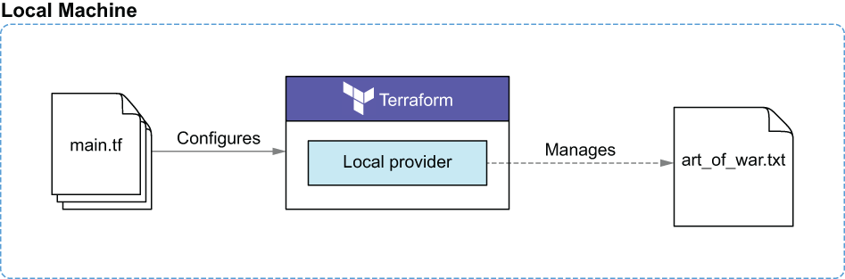
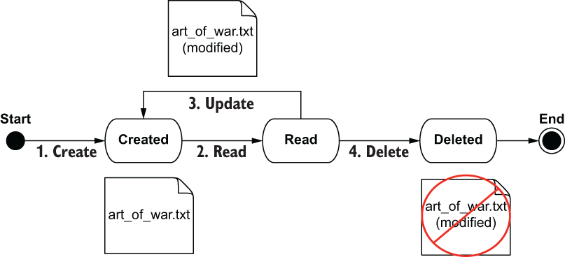
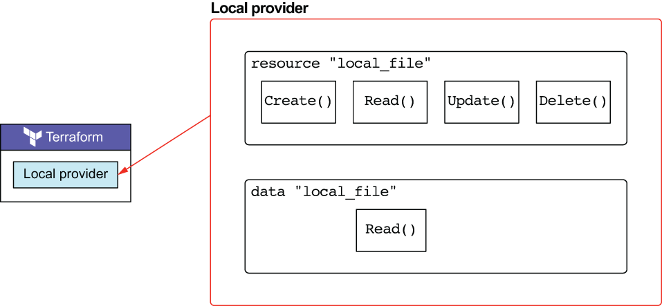

# Capitulo 2

## Life cycle do recurso Terraform

Neste capítulo, foi abordardo os tópicos a seguir:

- Gerando e aplicando plano de excucão.
- Analisando quando o Terraform triggres da funcão hooks.
- Usando o Local provider para criar e gerenciar os arquivos,
- Simulando, detectando e corrindo o drift da configuracão.
- Entendo os fundamentos do gerenciamento do Terraform state.
***

## Visão geral
Nos vamos usar o resource *local_file* do provider Local no Terraform oara create, read, update e delete um arquivo de texto contendo os primeiros paragrafos do livro The Art of War.

Visão de geral da arquitetura. Inputs e outputs do cenário Sun Tzu.

Primeiro, nos vamos criar o resource. Depois, vamos simular um drift na configuracão e atualizar. Finalmente vamos limpar com **terraform destroy**. O procedimento é mostrado abaixo:

***

### Life cycle da funcão hooks
Todos os resources do Terraform implementar a interface de esquema de resource. O Esquema do resource exique, entre outras coisa, que os resources definam CRUD functions hooks, um para cada um das operacões **Create()**, **Read()**,
**Update()** e **Delete()**.

Por ser um resource, *local_file* também implementar a interface de esquema do resource. Isso significa que define functions hooks para **Create()**, **Read()**, **Update()** e **Delete()**. Isto é contraste do *local_file* data source, que implementar apenas **Read()**

Os dois recursos do Local provider consistem em um resource gerenciado e um data source não gerenciado. O resource gerenciado implementar CRUD completo, equanto o data source apenas **Read()**

***

> **Observação:** Para manter o repositorio organazado o codigo do terraform ficará na pasta **code** juntamente com o README contendo a explicacão