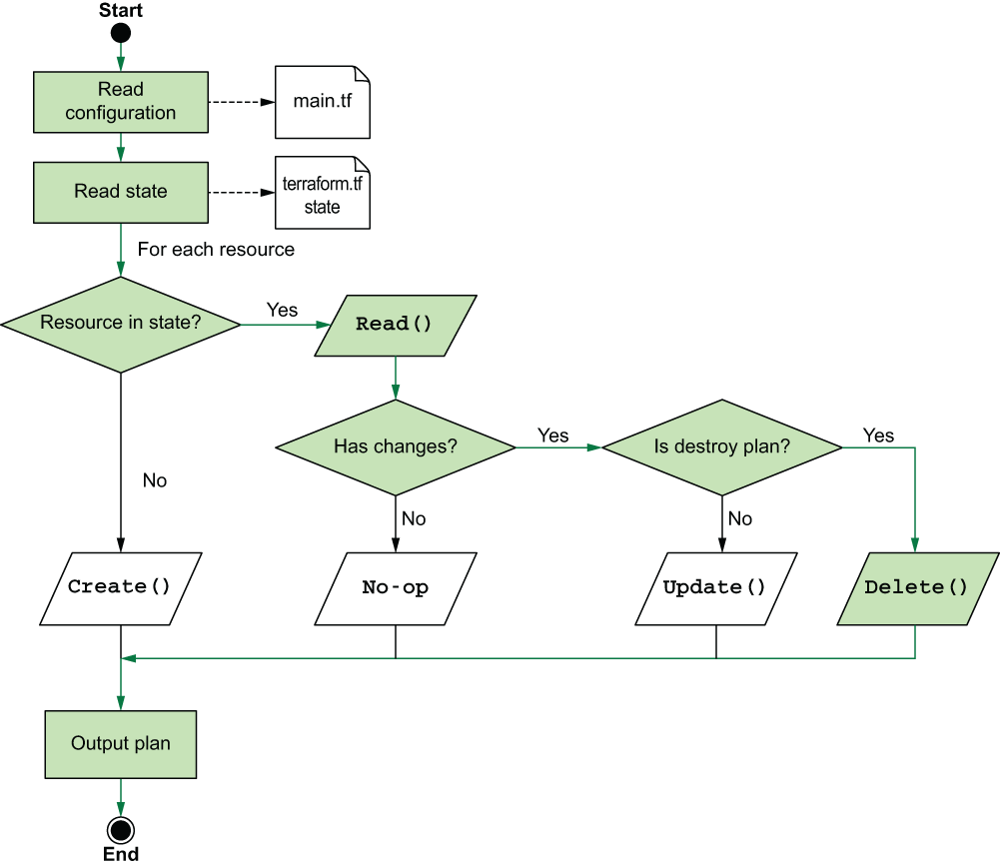

# Declarando o resource local file
No codigo tem dois blocos de configuracão. O primeiro bloco, **terraform {...}** é um bloco especial de configuracão responsavel por configurar o Terraform. O uso principal é version-locking do seu codigo, mas tambem é configurar onde seu state file é armazenado e onde os providers são baixados.

O segundo bloco de configuracão é bloco resource aquele q declara um resource *local_file*.
***

# Inicializando o workspace
A configuração do Terraform precisa ser inicializada pelo menos uma vez, mas talvez seja necessário inicializá-la novamente se você adicionar novos providers ou modules.
O ```terraform init``` é comanado idempotent, o que significa quando aplicada varias vezes tem o mesmo efeito que se fosse aplicada uma unica vez.

Depois de inicializado, Terraform cria diretorios ocultos *.terraform* para instalar plugins e modules.

Nesse exemplo, o diretório .terraform ficará assim:

    .
    ├── .terraform
    │    └── providers
    │        └── registry.terraform.io
    │            └── hashicorp
    │                └── local
    │                    └── 2.4.0
    │                        └── darwin_amd64
    │                            └── terraform-provider-local_v2.4.0_x5
    ├── .terraform.lock.hcl
    └── main.tf

# Gerando um plan

Antes de nos criar o resource **local_file** com terraform apply, nos podemos ver o que Terraform prentender fazer com ```terraform plan```. Sempre rode  ```terraform plan``` antes do deploy.

É possivel ler a saida do ```terraform plan``` em formato JSON. Pode ser util com ferramentas de automacão.
Primeiramente, salve a saída do plano ao definir a flag opcional -out:

```bash
terraform plan -out plan.out
```

O arquivo plan.out é salvo em formato binario, então o proximo passo é converte-lo para o formato JSON. Para isto ser feito usando o ```terraform show``` e redirecionando a saída para um arquivo.

```bash
terraform show -json plan.out > plan.json
```

# Criando o resource local file
Agora vamos executar o ```terraform apply```. Podemos executar o resultado do terraform plan explicitamente.

```bash
terraform plan -out plan.out && terraform apply "plan.out"
```

Dois arquivos foram criados como resultado deste comando: art_of_war.txt e terraform .tfstate. Seu diretório atual (excluindo arquivos ocultos) agora está da seguinte forma:

    .
    ├── book
         ├── art_of_war.txt
    ├── main.tf
    └── terraform.tfstate


O arquivo *terraform.tfstate* que você vê aqui é o arquivo state que o Terraform utiliza para manter o controle dos recursos que gerencia. Ele é usado para realizar comparações durante o plano e detectar diff na configuração.

> **Warning**  É importante não editar, excluir ou de alguma forma interferir no arquivo terraform.tfstate, ou o Terraform poderá potencialmente perder o controle dos recursos que gerencia.
***

# Terraform refresh
Terraform reconcilia o estado que ele conhece com o que está atualmente implantado. Isso pode ser feito com ```terraform refresh``` .

Você pode pensar no "terraform refresh" como um "terraform plan" que também altera o arquivo de estado. É uma operação somente leitura que não modifica a infraestrutura gerenciada existente, apenas o estado do Terraform.

Execute ```terraform refresh``` para reconciliar o estado do Terraform.

Em seguida rode ```terraform show``` para ver que o arquivo state foi atualizado.
***

# Excluindo o resource local_file 
Para realizar a limpeza execute o comando ```terraform destroy```

O ```terraform destroy``` primeiro gera um plano de execução como se não houvesse resource nos arquivos de configuração, realizando uma operação de leitura Read() em cada resource e marcando todos os resource existentes para exclusão. Isso pode ser observado na figura




Agora, o arquivo art_of_war.txt foi removido. O diretório atual é o seguinte:
  
    .
    ├── book
    |
    ├── main.tf
    └── terraform.tfstate
    ├── terraform.tfstate.backup
 
 Embora tenha desaparecido, sua memória persiste em um novo arquivo, ```terraform.tfstate.backup```. Este arquivo de backup é uma cópia do arquivo de estado anterior e está lá apenas para fins de arquivo. Normalmente, este arquivo não é necessário e pode ser excluído com segurança, se desejar, mas eu costumo deixá-lo. Nosso arquivo de estado atual está vazio.