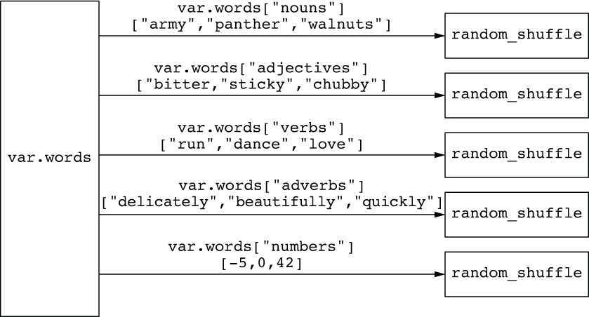
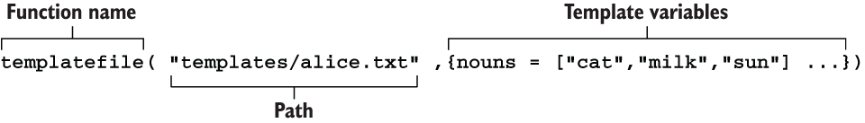
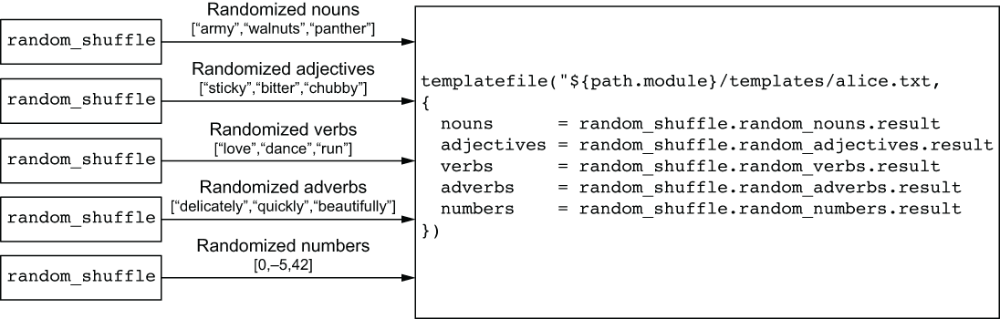
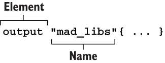

## Variables madlibs.tf
No bloco variable "words" do *madlibs.tf* qualquer valor definido deve ser coercível para este tipo complexo.

O tipo de objeto chave numeros em **var.words** poderia ser **list(string)** em vez de **list(number)** devido a coercão do tipo. A coercão de tipo é a capacidade de converter qualquer tipo primitivo no Terraform para sua representacão em string. Por exemplo, boleano "true" e "false" , enquanto números são convertidos de maneira semelhante (17 para "17").

A maioria das pessoas não estão cientes de que a coercão de tipo existe, porque ela acontece de forma tão transparente. Na verdade, a coerção de tipo ocorre sempre que você realiza interpolação de string sem lançar explicitamente o valor para uma string com tostring(). É importante estar ciente da coerção de tipo porque coercer acidentalmente um valor para uma string altera o resultado de certos cálculos (por exemplo, a expressão 17=="17" retorna false em vez de true).

***

## Atribuindo valores com um arquivo (terraform.tfvars) de definição de variável

Atribuir valores a variavel com o argumento **default** não é uma boa ideia, pois isso não facilita o codigo ser reutilizavel. O melhor jeito defnir valores é com um arquivo de definicão de variaveis, que é qualquer arquivo terminado em **.tfvars** ou **tfvars.json**. A variavel defenida no arquivo utiliza mesma sintaxe que o codigo de configuracão do terraform, mas consiste exclusivamente em atribuicões de variaveis.

No nosso exemplo o arquivo que definir os valores das variveis é **terraform.tfvars**
***

## Validando variaveis

Input variavles pode ser validas com regras customizadas ao declarar ao um bloco **validation**. Para validar que pelo menos 6 nouns são fornecidos em var.words, você pode escrever um bloco de validação da forma que ta no escrito no arquivo **madlibs.tf** no bloco validation.

O argumento da condicão em *validation* é uma expressao que determinar se a variavel é valida. *true* significa que é valida, *false* invalida. 
Expressões inválidas resultarão em um erro, e a mensagem de erro (error_message) será exibida ao usuário
***

## Embaralhando lists

Pode-se esperar que haja uma função chamada **shuffle()** que embaralharia uma lista genérica, mas não existe. Isso está ausente porque o Terraform busca ser uma linguagem de programação funcional, o que significa que todas as funções (com exceção de duas) são  pure functions. Pure functions retornam o mesmo resultado para um conjunto dado de argumentos de entrada e não causam efeitos colaterais adicionais. **shuffle()** não pode ser permitido porque os planos de execução gerados seriam instáveis, nunca convergindo para uma configuração fixa.

O provider Random para Terraform introduz um **random_shuffle** resource para embaralhar listas.

Como nos temos 5 listas, nos precisamos ter 5 **random_shuffle**. A figura abaixo ilustra isso:

[Documentacao do random_shuffle (Resource)](https://registry.terraform.io/providers/hashicorp/random/latest/ocs/resources/shuffle)

***

## Functions
Vamos usar a lista de palavras randomizadas para substituir valores no espaco reservado no arquivo de template. A funcão built-in **templatefile()** permite fazer isso facilmente. As funcões do Terraform são expressões que transformam entradas em saídas.

Podemos ver que o **templatefile()** aceita dois argumentos: um path para o arquivo template e um map de variaveis de template para ser renderizada. 

[Documentacao das Functions Built-in Terraform](https://developer.hashicorp.com/terraform/language/functions)

Agregando as listas de palavras embaralhadas em um mapa de variáveis do template.

## Outupu values
Podemos retornar o resultado do **templatefile()** para o usuario com output value. Output values são usado para fazer duas coisas: 

- Passar values entre modules
- Mostrar valor para o CLI

Sintaxe do para bloco output

> **Note** Que no codigo do arquivo "madlibs.tfv" há o bloco output o *path.module* serve como referencia para filesystem path que contém o module.

## Templates
Agora, vamos criar um arquivo modelo chamado "alice.txt".

Crie um diretório chamado "template" que contenha os arquivos de modelo. Dentro desse diretório, crie o arquivo "alice.txt".

A estrutura do diretório fica assim:

    .
    ├── template
         ├── alice.txt
    ├── madlibs.tf
    └── terraform.tfvars

